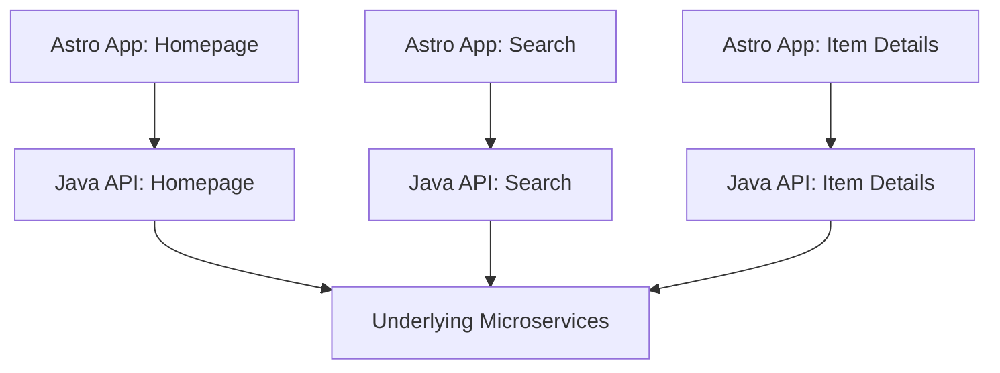

# Re-thinking Next.js: Why We Picked Astro for Kleinanzeigen's High-Traffic Frontend

> Real-world experiences from Germany's largest classifieds site
> 
> **Danilo Velasquez** · ReactJS Barcelona · June 10th, 2025

---

## Table of Contents
- [Re-thinking Next.js: Why We Picked Astro for Kleinanzeigen's High-Traffic Frontend](#re-thinking-nextjs-why-we-picked-astro-for-kleinanzeigens-high-traffic-frontend)
  - [Table of Contents](#table-of-contents)
  - [About](#about)
  - [Background: The Challenge](#background-the-challenge)
    - [The Legacy: "Haunted Forest"](#the-legacy-haunted-forest)
  - [The Search for a Modern Solution](#the-search-for-a-modern-solution)
  - [Framework Evaluation](#framework-evaluation)
    - [Next.js](#nextjs)
    - [Deno / Fresh](#deno--fresh)
    - [Astro (Chosen)](#astro-chosen)
  - [Why Astro?](#why-astro)
  - [Architecture Overview](#architecture-overview)
  - [Results](#results)
  - [Challenges \& Learnings](#challenges--learnings)
  - [When to Use Astro](#when-to-use-astro)
  - [Getting Started](#getting-started)
  - [Credits \& Links](#credits--links)

---

## About

This presentation tells the story of how Kleinanzeigen.de, Germany's #1 classifieds marketplace, re-architected its high-traffic frontend. It details the journey from a legacy Java monolith, through a failed unification project, to a modern, performant, and developer-friendly platform built with [Astro](https://astro.build/).

---

## Background: The Challenge

**Kleinanzeigen.de** (formerly eBay Kleinanzeigen) is a massive platform:
- 16+ years of history
- Hundreds of millions of pageviews daily
- 36 million active ads
- 500+ employees

### The Legacy: "Haunted Forest"
- Java Spring Boot monolith, JSPs, jQuery, and ~50 Preact/TypeScript microfrontends
- Painful releases (1 hour+), fragile local dev, slow time-to-market
- Teams avoided the core, leading to tech debt and low morale

---

## The Search for a Modern Solution

**Goals:**
- Evolve the platform with modern tools
- Improve time to market
- Maintain/improve SEO
- Prioritize HTML over JS

**Key Requirements:**
- Leverage React/Preact & TypeScript skills
- Improve DX & performance
- Excellent self-hosting support

**Lessons Learned:**
- A failed "unification project" (Next.js, 15k files, 18k tests, 100 devs, 1hr CI)
- Business pivot led to a new modernization journey

---

## Framework Evaluation

### Next.js
- **Pros:** Familiar, huge community, React/Preact support
- **Cons:** Painful upgrades, self-hosting is hard, performance/hydration issues, not optimized for static/SEO-heavy sites

### Deno / Fresh
- **Pros:** Clean SSR, Preact everywhere, good DX, Tailwind support
- **Cons:** Small community, maturity risk, Deno adoption hurdles

### Astro (Chosen)
- **Pros:**
  - Island Architecture: HTML by default, hydrate only what you need
  - UI framework agnostic (React, Preact, Vue, etc.)
  - Mature, self-hosting first, vibrant community
  - Directly addressed performance and 3rd-party script issues
- **Cons:**
  - New syntax/tooling to learn
  - Migration of styled-jsx widgets needed

---

## Why Astro?

**Island Architecture Advantage 🏝️**
- HTML first, JavaScript only where needed
- Selective hydration for interactive components
- Zero JS by default, granular control
- Solved hydration and 3rd-party script conflicts from Next.js

---

## Architecture Overview



*Each Astro app is paired with its own Java API backend, all connecting to shared microservices. This enables team autonomy and independent releases.*

---

## Results

- **Performance:**
  - Lighthouse score: Java ~64/100 → Astro ~69/100 (pre-optimization)
  - Less JS by default, clear path for further improvements
- **Developer Experience:**
  - Onboarding: <15 min (Astro) vs days (Java)
  - CI/CD: Lint+Unit ~1.5min, E2E ~2min, Build+Deploy ~5min (vs 15-60min Java)
  - Positive developer feedback: "Very smooth and easy to use", "Nice and modern"
- **Widget Reuse:**
  - Existing Preact microfrontends mostly reused with minimal changes
- **Gradual Rollout:**
  - 1% → 10% → 40% → 100% traffic

---

## Challenges & Learnings

- Learning curve: `.astro` syntax, new concepts
- Testing: Migration from styled-jsx to Tailwind, Vitest adoption
- Monitoring/logging: Custom setup needed
- Multi-app coordination: Ongoing platform team effort

---

## When to Use Astro

Astro is a great fit if:
- Your site is content-heavy (static HTML focus)
- You want to minimize client-side JS
- You need fine-grained control over UI interactivity
- You require excellent self-hosting support
- You value flexibility to mix UI frameworks
- You're facing hydration/3rd-party script performance issues

---

## Getting Started

To run the slides locally:

```sh
npm install
npm run dev
```

Then visit [http://localhost:3030](http://localhost:3030)

Edit [`slides.md`](./slides.md) and [`pages/*.md`](./pages/) to see changes.

---

## Credits & Links

- **Author:** Danilo Velasquez ([d13z.dev](https://d13z.dev))
- **Event:** ReactJS Barcelona, June 10th, 2025
- [LinkedIn](https://www.linkedin.com/in/danilovelasquez/) · [GitHub](https://github.com/dvelasquez)
- [Learn more about Slidev](https://sli.dev/)
- [Astro Documentation](https://docs.astro.build/)
