# The Java Monolith: Status Quo

```mermaid
flowchart LR
    JavaApp["Java Monolith <br> (Spring Boot, JSP, jQuery) <br>1 Hour release"]
    AllFeatures["All Features (Homepage, Search, Item Details, etc.)"]
    JavaApp --> AllFeatures
    
    %% Microfrontends (UMD/ESM Widgets)
    GDPR["GDPR Banner <br>4 min release"]
    Promo["Promotion Banner <br>4 min release"]
    MsgBox["MessageBox <br>4 min release"]
    Others["...47 other widgets"]
    
    AllFeatures --> GDPR
    AllFeatures --> Promo
    AllFeatures --> MsgBox
    AllFeatures --> Others
    
    style JavaApp fill:#22223b,stroke:#f2e9e4,stroke-width:2px
    style AllFeatures fill:#283618,stroke:#fefae0,stroke-width:2px
    style GDPR fill:#1b263b,stroke:#e0aaff,stroke-width:2px
    style Promo fill:#3a0ca3,stroke:#f72585,stroke-width:2px
    style MsgBox fill:#005f73,stroke:#94d2bd,stroke-width:2px
```


<!-- 

*In the legacy setup, a single Java application handled all frontend and backend logic. To avoid changing the monolith, teams developed microfrontends (like the GDPR Banner, Promotion Banner, and MessageBox) as React/Preact UMD/ESM bundles. These widgets are mounted into the main features at runtime and can be released independently from the main Java app.* 

In our version of the Haunted Forest, we created microfrontends (called widgets).

This lead to have more than 50 microfrontends.

Talk a little about the ones mentioned here.

 -->

---
layout: default
---

# A Microfrontend Example

This example is a GDPR banner that is loaded on all pages.

<br>
<br>

```html{1-2|3|4-14|5|8-13|all}
<script type="module" 
  src="https://www.kleinanzeigen.de/gdpr/gdpr-consent-management-platform/es/tcfApiStub.min.js"></script> 
<div id="consentBanner" data-initialprops="{...}" class="gdpr-cmp"></div> 
<script type="module">
const consentBannerUrl = "https://www.kleinanzeigen.de/gdpr/gdpr-consent-management-platform/es/tcfApiBanner.min.js";

import(consentBannerUrl)
  .then((module) => {
    window.ekGdprConsentBanner = module;
    // fire an event when consent is ready
    const event = new CustomEvent("gdpr.consent-ready");
    document.dispatchEvent(event);    
  });
</script>
```

<!-- Don't over explain this slide -->