# The Java Monolith: Status Quo

```mermaid
flowchart LR
    JavaApp["Java Monolith <br> (Spring Boot, JSP, jQuery) <br>1 Hour release"]
    AllFeatures["All Features (Homepage, Search, Item Details, etc.)"]
    JavaApp --> AllFeatures
    
    %% Microfrontends (UMD/ESM Widgets)
    GDPR["GDPR Banner <br>4 min release"]
    Promo["Promotion Banner <br>4 min release"]
    MsgBox["MessageBox <br>4 min release"]
    Others["...47 other widgets"]
    
    AllFeatures --> GDPR
    AllFeatures --> Promo
    AllFeatures --> MsgBox
    AllFeatures --> Others
    
    style JavaApp fill:#22223b,stroke:#f2e9e4,stroke-width:2px
    style AllFeatures fill:#283618,stroke:#fefae0,stroke-width:2px
    style GDPR fill:#1b263b,stroke:#e0aaff,stroke-width:2px
    style Promo fill:#3a0ca3,stroke:#f72585,stroke-width:2px
    style MsgBox fill:#005f73,stroke:#94d2bd,stroke-width:2px
```



<!--
- This diagram illustrates the situation perfectly. The big Java Monolith on the left handled everything, and releasing a change through it took at least an hour.
- To get around this, teams built these small, independent widgets, like the GDPR banner or promotional pop-ups, which could be released in just a few minutes.
- While this gave us some agility, it created a fragmented ecosystem of over 50 widgets and didn't solve the core problem: we couldn't efficiently improve our main user-facing features like search or the homepage.
-->

---
layout: default
---

# A Microfrontend Example

This example is a GDPR banner that is loaded on all pages.

<br>
<br>

```html{1-2|3|4-14|5|8-13|all}
<script type="module" 
  src="https://www.kleinanzeigen.de/gdpr/gdpr-consent-management-platform/es/tcfApiStub.min.js"></script> 
<div id="consentBanner" data-initialprops="{...}" class="gdpr-cmp"></div> 
<script type="module">
const consentBannerUrl = "https://www.kleinanzeigen.de/gdpr/gdpr-consent-management-platform/es/tcfApiBanner.min.js";

import(consentBannerUrl)
  .then((module) => {
    window.ekGdprConsentBanner = module;
    // fire an event when consent is ready
    const event = new CustomEvent("gdpr.consent-ready");
    document.dispatchEvent(event);    
  });
</script>
```

<!--
- Here’s a real-world example of one of those widgets. This is how our GDPR banner was loaded.
- Don't worry too much about the code details. The key takeaway is that we were injecting these isolated JavaScript modules into the monolith's HTML at runtime.
- It worked, but it was a symptom of a larger architectural problem. We were patching the ship instead of rebuilding it.
-->
