# The Java Monolith: Status Quo

```mermaid
flowchart LR
    JavaApp["Java Monolith (Spring Boot, JSP, jQuery)"]
    AllFeatures["All Features (Homepage, Search, Item Details, etc.)"]
    JavaApp --> AllFeatures
    
    %% Microfrontends (UMD Widgets)
    GDPR["GDPR Banner (Preact UMD)"]
    Promo["Promotion Banner (Preact UMD)"]
    MsgBox["MessageBox (React UMD)"]
    
    AllFeatures --> GDPR
    AllFeatures --> Promo
    AllFeatures --> MsgBox
    
    style JavaApp fill:#22223b,stroke:#f2e9e4,stroke-width:2px
    style AllFeatures fill:#283618,stroke:#fefae0,stroke-width:2px
    style GDPR fill:#1b263b,stroke:#e0aaff,stroke-width:2px
    style Promo fill:#3a0ca3,stroke:#f72585,stroke-width:2px
    style MsgBox fill:#005f73,stroke:#94d2bd,stroke-width:2px
```

*In the legacy setup, a single Java application handled all frontend and backend logic. To avoid changing the monolith, teams developed microfrontends (like the GDPR Banner, Promotion Banner, and MessageBox) as React/Preact UMD bundles. These widgets are mounted into the main features at runtime and can be released independently from the main Java app.* 