# The New Approach: Multi-App Astro Architecture

```mermaid
flowchart TB
    Astro1["Astro App: Homepage"]
    Astro2["Astro App: Search"]
    Astro3["Astro App: Item Details"]
    Astro1 --> JavaAPI1["Java API: Homepage"]
    Astro2 --> JavaAPI2["Java API: Search"]
    Astro3 --> JavaAPI3["Java API: Item Details"]
    JavaAPI1 --> Microservices["Underlying Microservices"]
    JavaAPI2 --> Microservices
    JavaAPI3 --> Microservices
    style Astro1 fill:#606c38,stroke:#fefae0,stroke-width:2px
    style JavaAPI1 fill:#283618,stroke:#fefae0,stroke-width:2px
    style Astro2 fill:#b08968,stroke:#e6ccb2,stroke-width:2px
    style JavaAPI2 fill:#bc6c25,stroke:#ffba08,stroke-width:2px
    style Astro3 fill:#4361ee,stroke:#4cc9f0,stroke-width:2px
    style JavaAPI3 fill:#3a0ca3,stroke:#4361ee,stroke-width:2px
    style Microservices fill:#232946,stroke:#eebbc3,stroke-width:2px
```

 

*In the new architecture, each Astro app is paired with its own Java API backend, all connecting to shared microservices. This enables team autonomy and independent releases.* 

<!-- The WHY: We already know the pitfalls of both sides:

Having 50 applications to take care of or

Having a big one that is hard to maintain.

We are looking for a balance. -->